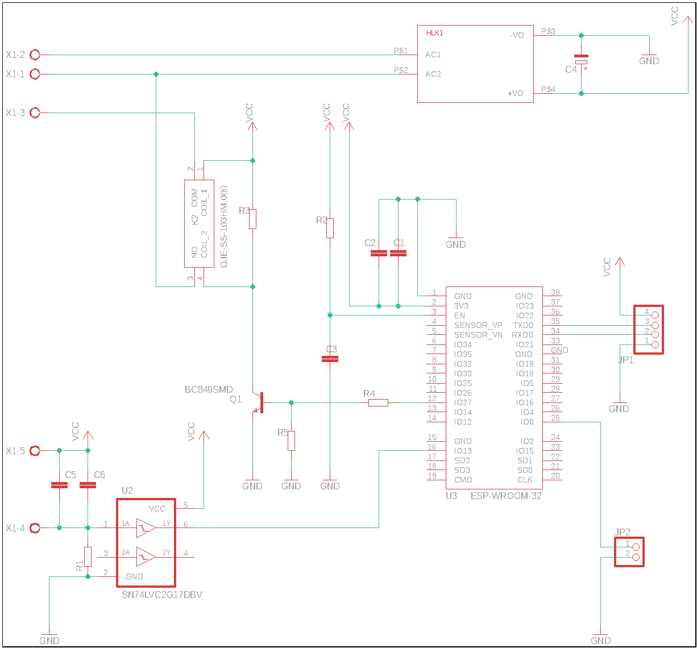
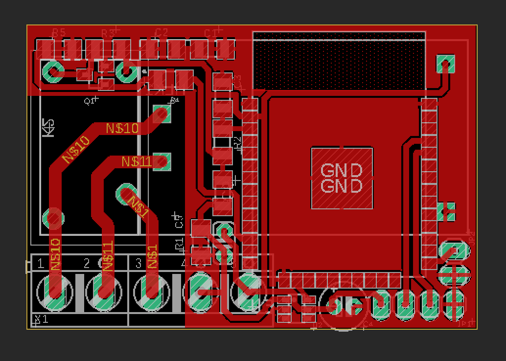
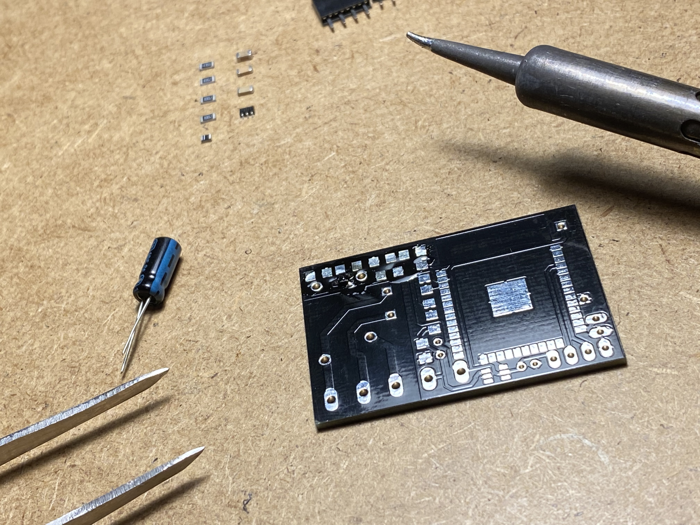

# EPS32 SmartSwitch compatibile with Apple HomeKit Protocol

  

 # Project overview
 >In this project I will show my device which is Smart Switch module that is compatible with Apple HomeKit Protocol. The module is really tiny. Thanks to it miniature size it fit most of the flush mounted junction boxes and light switch sockets.  Just mount it under your current switch or power socket to get full Apple HomeKit compatibility. You will able to turn on/off the lights, electrical appliances or cut off power from the power sockets. Using Apple Home app enables automations, scenes and integration with Siri.
 
  

# Electrical schematic
I have started with electrical schematic of my device. The basic connections are as specified by the chip manufacturer in [ESP32-WROOM-32d-Datasheet] and the rest depends on my knowledge, experience and prototyping.   
The most important elements are:
* ESP32 SoC
* HLK-PM03 -  power supply
* 74LVC1G14GW - Schmitt trigger for phisical switch noise filtering
* OJE-SS-103HM.000 - electromagnetic relay
* Transistor for relay triggering
* Some passive elements for filtering and current limitting
* Connectors

  

# PCB designing
The PCB design is created from my electrical schematic. The first step was connecting and testing device on breadboard. After succesfully prototyping I have made homemade prototype PCB. When all device was mounted, programmed, tested and running fine I've ordered PCB from [ALLPCB] 
  
### PCB design

  

### Ordered PCB

  

### Homemade prototype & manufactured PCB

  

# Assembly
After reciving ordered PCB's I started assembly.
I have all needed tools at home and skills to build and program my device.

  

# Flashing 
When I started this project HomeKit Accessory Development Kit (ADK) was available only for MFi Program, also ESP32 manufacture did't provide any information how to establish HomeKit connection. I decided to use and modify code from: 
[maximkulkin/esp-homekit]

Whole communication is based on HomeKit Accessory Server from Maxim, but how physically device is working is all my job.
In Maxim's project the WiFi Credentials are hard coded and cannot be modified after flashing device. I have added support for [ESP-IDF Wi-Fi Provisioning], now user can provide WiFi credentials via app even after flashing accessory. The next feature I have added is support for two way of controlling accessory. First directly from HomeKit app and the second one by current wallmounted physical switch.

### Flashing

[ESP32]: <https://www.espressif.com/en/products/socs/esp32>
[ESP-IDF]: <https://docs.espressif.com/projects/esp-idf/en/latest/esp32/>
[ESP-IDF Wi-Fi Provisioning]: <https://docs.espressif.com/projects/esp-idf/en/latest/esp32/api-reference/provisioning/wifi_provisioning.html#>
[LEDC documentatiton]: <https://docs.espressif.com/projects/esp-idf/en/latest/esp32/api-reference/peripherals/ledc.html>
[Bluetooth Example Walkthrough]: <https://github.com/espressif/esp-idf/blob/1067b28707e527f177752741e3aa08b5dc64a4d7/examples/bluetooth/bluedroid/ble/gatt_server_service_table/tutorial/Gatt_Server_Service_Table_Example_Walkthrough.md>

[ALLPCB]: <https://www.allpcb.com>
[maximkulkin/esp-homekit]: <https://github.com/maximkulkin/esp-homekit>
[ESP32-WROOM-32d-Datasheet]: <https://www.espressif.com/sites/default/files/documentation/esp32-wroom-32d_esp32-wroom-32u_datasheet_en.pdf>

