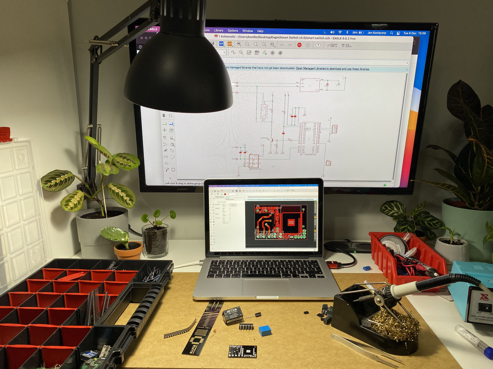
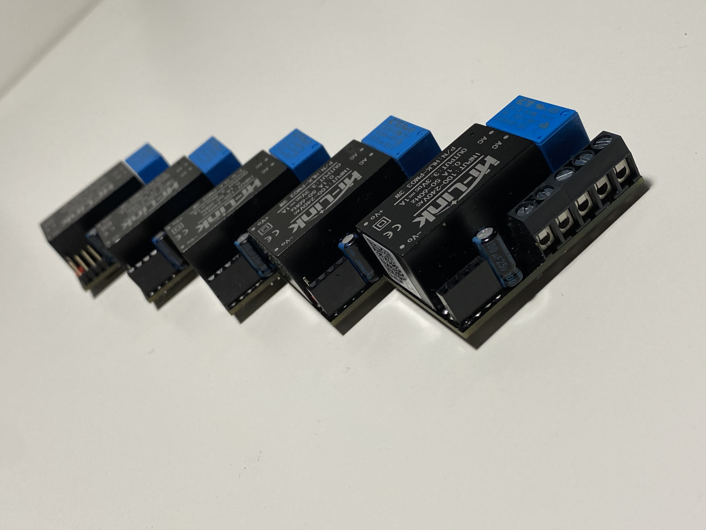
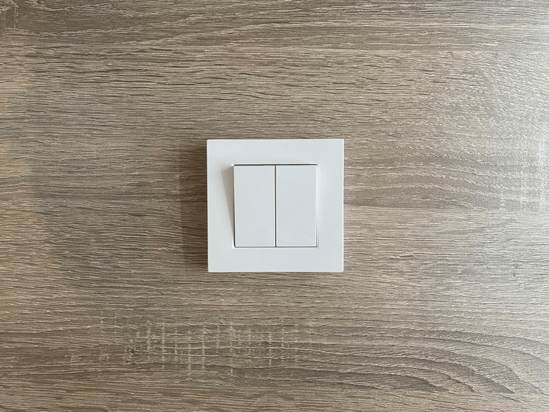

# SmartSwitch compatible with Apple HomeKit Protocol

  

 

# Project overview

The remotely operated SmartSwitch is designed to turn electrical devices or circuits on and off. The compact size of the device allows for the product to be installed in the housings of other devices. Thanks to its miniature size it fits most of the flush-mounted junction boxes and light switch sockets. The devices can be controlled either via the Apple HomeKit or with buttons connected directly to them.
Using Apple Home app enables automations, scenes and integration with Siri.

 

# Electrical schematic
I have started with an electrical schematic of my device. The basic connections are as specified by the chip manufacturer in [ESP32-WROOM-32d-Datasheet] and the rest depends on my knowledge, experience, and prototyping. 
After creating a schematic I connected all elements on a breadboard. When the breadboard prototype worked successfully I attempted to make PCB.

The most important elements are:
* ESP32 SoC
* HLK-PM03 - power supply
* 74LVC1G14GW - Schmitt trigger for physical switch noise filtering
* OJE-SS-103HM.000 - electromagnetic relay
* Transistor for relay triggering
* Some passive elements for filtering and current limiting
* Connectors

  

 

# PCB designing
The PCB design is based on my electrical schematic. The first step was creating a homemade PCB prototype. When the whole device was mounted, flashed, tested, and running finely I've ordered PCB from [ALLPCB] 

 

## PCB design

 

## Ordered PCB

 

## Prototype & manufactured PCB

  

# Assembly
I have all needed tools and skills to build and flash my device at home .

 

# Writing program 
When I started this project HomeKit Accessory Development Kit (ADK) was available only for MFi Program, also ESP32 manufacture didn't provide any information on how to establish HomeKit connection. I decided to use and modify code from: 
[maximkulkin/esp-homekit]

The whole communication is based on HomeKit Accessory Server from Maxim, but how physically device is working is all my job.
Because Apple doesn't allow to use Apple's WAC (Wireless Accessory Configuration) feature for devices without MFi license we need to provide WiFi credentials in another way.
In Maxim's project the WiFi Credentials are hardcoded and cannot be modified after flashing the device. I have added support for [ESP-IDF Wi-Fi Provisioning], now user can provide WiFi credentials via [ESP SoftAP Provisioning] app even after flashing accessory. The next feature I have added is support for two ways of controlling the accessory. First directly from HomeKit app and the second one by the current wall-mounted physical switch.

## Flashing

 

# Final Mounting

  

>
* The device is designed to control other electrical devices and
operate in their housings. Faulty connection or use may result in fire or electric shock.

* All works on the device may be performed only by a qualified and licensed electrician. Observe national regulations.

* Even when the device is turned off, voltage may be present at
its terminals. Any maintenance introducing changes into the configuration of connections or the load must be always performed with the disabled fuse or power supply.

 

 

## Provisioning WiFi credentials & adding to HomeKit
As I mentioned before Apple doesn't allow to use Apple's WAC (Wireless Accessory Configuration) feature for devices without MFi license so we will use an official application which is available in AppStore: [ESP SoftAP Provisioning] from [ESP32] manufacturer. After successfully connecting to WiFi the HomeKit Accessory is ready to add to your home.

  

[ESP32]: <https://www.espressif.com/en/products/socs/esp32>
[ESP-IDF]: <https://docs.espressif.com/projects/esp-idf/en/latest/esp32/>
[ESP-IDF Wi-Fi Provisioning]: <https://docs.espressif.com/projects/esp-idf/en/latest/esp32/api-reference/provisioning/wifi_provisioning.html#>

[ESP SoftAP Provisioning]: <https://apps.apple.com/us/app/esp-softap-provisioning/id1474040630>
[LEDC documentation]: <https://docs.espressif.com/projects/esp-idf/en/latest/esp32/api-reference/peripherals/ledc.html>
[Bluetooth Example Walkthrough]: <https://github.com/espressif/esp-idf/blob/1067b28707e527f177752741e3aa08b5dc64a4d7/examples/bluetooth/bluedroid/ble/gatt_server_service_table/tutorial/Gatt_Server_Service_Table_Example_Walkthrough.md>

[ALLPCB]: <https://www.allpcb.com>
[maximkulkin/esp-homekit]: <https://github.com/maximkulkin/esp-homekit>
[ESP32-WROOM-32d-Datasheet]: <https://www.espressif.com/sites/default/files/documentation/esp32-wroom-32d_esp32-wroom-32u_datasheet_en.pdf>

